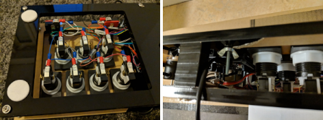

# Katboard

Simple IIDX controller with full-acrylic casing

## Specifications

| Height | Width | Length | Turntable diameter |
| :--: | :--: | :--: | :--: |
| 6~7cm | 20cm | 46cm | 16cm |

## Features

- No custom parts other than twisting four wires together
- Assembly time: 1~3 hours
- Optional 9 keys or 10 keys before manufacturing
- Optional 1P or 2P layout during assembly
- All 10 button-lights working
- Low friction turntable; no designed ways to adjust the friction, but adjusting the tightness of the circlip would work

- Opened bottom and sides; maintainence of switches without opening up the casing

## Setup Tutorial

An exhaustive tutorial on all setup steps (Chinese only):

[https://docs.qq.com/doc/DQ0tlWXB1QU5QcVdQ](https://docs.qq.com/doc/DQ0tlWXB1QU5QcVdQ)

## Credits

- Matthew Heironimus's Arduino Joystick Library, licensed in LGPLv3: [MHeironimus/ArduinoJoystickLibrary](https://github.com/MHeironimus/ArduinoJoystickLibrary)
- Tester: RVG, exhaustive feedbacks on the tutorial
